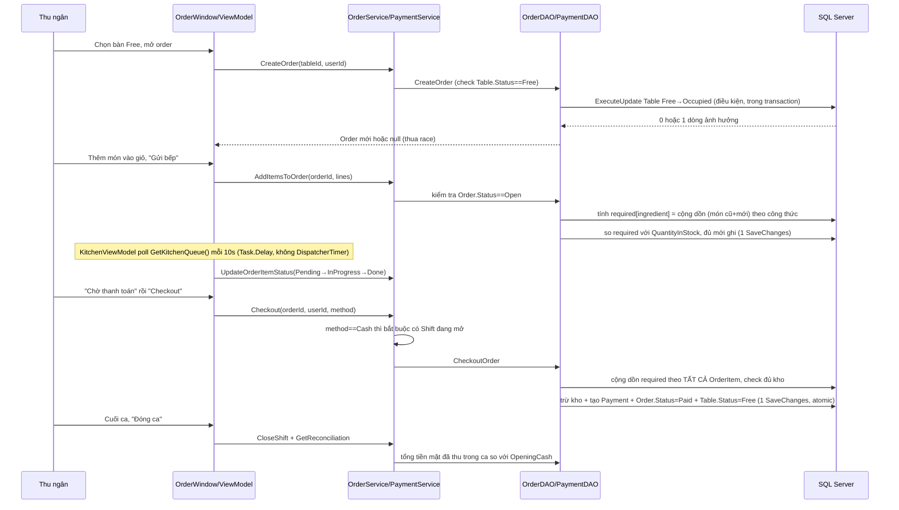

# Tài liệu bảo vệ đồ án — RestaurantPOS

Tài liệu này tổng hợp: kiến trúc code, luồng nghiệp vụ chính, các điểm phức tạp cần lưu ý khi bị hỏi xoáy, cách trình bày luồng thêm 1 tính năng mới, và danh sách câu hỏi giảng viên có khả năng hỏi kèm gợi ý trả lời.

Tài liệu nền đã có sẵn, đọc trước khi vào phần dưới:
- `CONTEXT.md` (gốc repo) — kiến trúc, domain glossary, quyết định thiết kế, trade-off đã resolve.
- `docs/adr/` — 4 quyết định kiến trúc (MVVM vs MVC, hash mật khẩu, .NET 10, cash cần shift mở).

---

## 1. Kiến trúc tổng quan

Layered architecture, 5 project trong solution:

```
RestaurantPOS.WpfApp            Views (XAML) + ViewModels + MVVM/{RelayCommand, ViewModelBase}
        ↓ gọi
RestaurantPOS.Services          Business logic (I*Service + *Service)
        ↓ gọi
RestaurantPOS.Repositories       Wrap DAO (I*Repository + *Repository) — mỏng, gần như pass-through
        ↓ gọi
RestaurantPOS.DataAccessObjects  DAO tĩnh (static class) + AppDbContext (EF Core) — NƠI LOGIC PHỨC TẠP THẬT SỰ NẰM
        ↓ dùng
RestaurantPOS.BusinessObjects    Entity thuần (POCO) + enum trạng thái
```

Không dùng DI container. Mỗi Service/ViewModel tự `new` dependency của mình trong constructor (`_orderRepository = new OrderRepository()`). Có thêm constructor nhận interface — **chỉ để test**, không dùng trong code chạy thật (xem comment `// Test seam only`).

**Điểm hay bị hỏi:** "Sao không dùng DI container (Autofac/Microsoft.Extensions.DependencyInjection)?" → Trả lời: đây là quyết định giữ đơn giản theo đúng độ phức tạp môn học yêu cầu (xem `CONTEXT.md` — theo sát style project mẫu `ProductManagementDemoEF_MVVM`), không phải thiếu sót. Repository/Service vẫn có interface nên vẫn mock được để test (`RestaurantPOS.Tests`).

### Vì sao 3 lớp Repository/Service/DAO thay vì 1 lớp?

- **DAO**: chỉ biết EF Core, `DbContext`, transaction, `SaveChanges`. Không chứa business rule.
- **Repository**: interface hoá DAO tĩnh, để Service test được (mock qua interface) mà không cần DB thật.
- **Service**: chứa business rule (điều kiện được/không được làm), điều phối nhiều Repository nếu cần.
- **ViewModel**: chỉ gọi Service, expose property/command cho View bind — không chứa business logic (rule cứng của project, xem `CONTEXT.md` §Git conventions — "no business logic in View code-behind").

---

## 2. Domain model (tóm tắt — chi tiết xem CONTEXT.md)

```
User (Admin/Cashier/KitchenStaff) ─┬─< Order ─< OrderItem >─ MenuItem >─< MenuItemIngredient >─ Ingredient
                                    ├─< Shift ─< Payment
                                    └─< Payment ── Order (1–0..1)

RestaurantTable ─< Order
MenuCategory ─< MenuItem
```

Điểm đáng nói:
- `MenuItemIngredient` là **join entity tường minh** (không phải many-to-many ngầm của EF) — vì cần lưu `QuantityRequired` (công thức) trên chính quan hệ đó. Đây là thứ cho phép trừ kho tự động.
- `Order.OrderItems` là `IReadOnlyCollection`, chỉ thêm được qua `Order.AddItem(...)` — composition, không có public setter. Encapsulation thật, không phải chỉ để đẹp code.
- `TableStatus`, `OrderStatus`, `OrderItemStatus` là enum — loại bỏ lớp lỗi "trạng thái không hợp lệ" ngay từ compile-time, không dùng string.

---

## 3. Luồng nghiệp vụ chính (main flow)



Đây là luồng nên thuộc lòng để trình bày: **mở bàn → tạo order → thêm món (trừ-kho-ảo để check) → bếp xử lý (polling) → chờ thanh toán → checkout (trừ kho thật, atomic) → đóng ca (đối soát tiền mặt)**.

---

## 4. Các điểm phức tạp — PHẢI hiểu sâu, hay bị hỏi xoáy

### 4.1. Race condition khi đặt bàn (`OrderDAO.CreateOrder`)

2 thu ngân bấm mở cùng 1 bàn cùng lúc. Không check-rồi-update 2 bước (có race window), mà dùng **conditional `ExecuteUpdate`**:

```csharp
context.RestaurantTables
    .Where(t => t.TableId == tableId && t.Status == TableStatus.Free)
    .ExecuteUpdate(s => s.SetProperty(t => t.Status, TableStatus.Occupied));
```

Update có điều kiện `WHERE Status=Free` chạy atomic dưới DB. Ai thua cuộc nhận `rowsAffected == 0`, không tạo được Order thứ 2 trên cùng bàn. Không cần concurrency token riêng cho `RestaurantTable`.

**Nếu bị hỏi "sao không lock table hay dùng transaction isolation level cao hơn":** đây chính là lý do dùng transaction bao ngoài + update điều kiện thay vì SELECT rồi UPDATE riêng — tránh đúng TOCTOU (time-of-check-to-time-of-use).

### 4.2. Cộng dồn theo nguyên liệu, không check/trừ theo từng món riêng lẻ

2 món khác nhau dùng chung 1 nguyên liệu (vd tỏi) — nếu check tồn kho **độc lập từng món** thì cả hai đều pass dù tổng vượt tồn kho thật. Cả 2 method đều cộng dồn theo dictionary trước khi làm gì tiếp, nhưng **không giống hệt nhau** — dễ nhầm nếu học thuộc chung 1 câu, phải phân biệt rõ:

- **`OrderDAO.AddItemsToOrder`** — chỉ 2 bước: cộng dồn `required` (món **cũ đã có trên order** + món **mới đang thêm**, vì tồn kho phải tính trên tổng chứ không chỉ batch mới) rồi **check** so với `QuantityInStock`. Đủ mới `order.AddItem(...)` + `SaveChanges()`. **Không trừ kho ở đây** — đây chỉ là "trừ-kho-ảo để check", kho thật chưa đổi.
- **`PaymentDAO.CheckoutOrder`** — 3 bước: cộng dồn `required` theo **toàn bộ OrderItem của order** → check đủ kho → **trừ thật** `QuantityInStock -= quantityNeeded`. Đây mới là lúc kho thật sự bị trừ.

```csharp
var required = new Dictionary<int, decimal>();
foreach (var item in allItems)
    foreach (var recipeLine in item.MenuItem.MenuItemIngredients)
        required[recipeLine.IngredientId] += recipeLine.QuantityRequired * item.Quantity;

foreach (var (ingredientId, needed) in required)
    if (stock[ingredientId] < needed) return InsufficientStock;
// chỉ CheckoutOrder mới có thêm bước dưới đây:
foreach (var (ingredientId, needed) in required)
    stock[ingredientId] -= needed;
```

**Nếu bị hỏi "vậy khi nào kho thật sự bị trừ?"** → chỉ lúc checkout (thanh toán), không phải lúc gửi bếp. Gửi bếp chỉ đảm bảo "đủ nguyên liệu tại thời điểm gửi", không khoá/giữ chỗ nguyên liệu cho các order khác đang mở song song (giới hạn đã biết, xem comment `ponytail:` trong `OrderDAO.AddItemsToOrder`).

### 4.3. Transaction atomic — thanh toán và trừ kho không bao giờ tách rời

`PaymentDAO.CheckoutOrder`: tạo `Payment` + trừ từng `Ingredient.QuantityInStock` + đổi `Order.Status=Paid` + đổi `Table.Status=Free`, tất cả trong **1 `SaveChanges()`** — EF Core tự bọc trong 1 DB transaction. Không có transaction thủ công (`BeginTransaction`) ở đây vì 1 `SaveChanges` đã đủ atomic; `CreateOrder` thì có `BeginTransaction` tường minh vì cần 2 lệnh riêng (`ExecuteUpdate` + `SaveChanges`) phải cùng thành công hoặc cùng rollback.

### 4.4. Concurrency token (`RowVersion`)

`Order` và `Ingredient` có cột `RowVersion` (`IsRowVersion()`). Nếu 2 thu ngân sửa cùng 1 order (vd 1 người hủy, 1 người checkout gần như cùng lúc), EF ném `DbUpdateConcurrencyException` — code bắt exception này và trả về lỗi (`Conflict`) thay vì ghi đè âm thầm. Đây là điểm khác biệt với cách xử lý race ở bàn (`RestaurantTable` không có RowVersion, dùng `ExecuteUpdate` thay thế) — **2 kỹ thuật khác nhau cho 2 tình huống khác nhau**, nên biết giải thích tại sao chọn cái nào cho trường hợp nào.

### 4.5. Ràng buộc "1 user chỉ 1 shift mở" ở 2 lớp

- Service (`ShiftService.OpenShift`): check nhanh `GetOpenShift(userId) != null`.
- DB (`AppDbContext`): unique filtered index `HasIndex(s => s.UserId).IsUnique().HasFilter("[ClosedAt] IS NULL")`.

Check ở Service là TOCTOU (không atomic), index ở DB mới là ràng buộc thật sự chặn được race. Nếu giảng viên hỏi "check ở Service có đủ không" → trả lời: không đủ một mình, đó chỉ là fast-path UX (báo lỗi sớm, đẹp hơn); ràng buộc cứng nằm ở unique index.

### 4.6. Kitchen display: polling, không push

`KitchenViewModel` chạy vòng lặp `async Task` + `Task.Delay(10s)`, không dùng `DispatcherTimer` (để query DB không chặn UI thread), kết quả marshal về qua `Application.Current.Dispatcher.Invoke`. Đây là quyết định có chủ đích (xem `CONTEXT.md` — scope không có SignalR/WebSocket, chỉ chạy LAN 1 quán). Nếu bị hỏi "sao không real-time" → trả lời đây là trade-off đã ghi nhận, chấp nhận độ trễ tối đa 10s cho quy mô 1 nhà hàng, không phải thiếu sót.

### 4.7. Mật khẩu

PBKDF2 qua `Rfc2898DeriveBytes` (`PasswordHasher.cs`), không dùng thư viện ngoài (xem ADR-0002). Biết giải thích khác gì so với hash thường (MD5/SHA1 không có salt+iteration) nếu bị hỏi về bảo mật.

---

## 5. Luồng code khi thêm 1 tính năng mới

Đi từ dưới lên đúng thứ tự code thật sự chạy:

1. **BusinessObjects** — entity/enum có sẵn chưa? Cần thêm field/entity mới không.
2. **DataAccessObjects** — nếu đổi entity, thêm EF Core migration (`dotnet ef migrations add`); thêm method static vào DAO tương ứng (chỉ thao tác DB, không chứa rule).
3. **Repositories** — thêm method vào `I*Repository` + impl, gọi thẳng DAO (pass-through).
4. **Services** — thêm method vào `I*Service` + impl. **Đây là chỗ đặt business rule** (điều kiện được/không được, điều phối nhiều repository).
5. **ViewModels** — gọi Service, expose property/`ObservableCollection`/`RelayCommand` cho View bind.
6. **Views (XAML)** — bind control tới ViewModel, không viết logic trong code-behind.

**Giảm độ phức tạp khi trình bày:**
- Mỗi tính năng nhỏ = sửa tối thiểu 1 method/lớp, không tạo thêm layer mới.
- Business rule chỉ đặt ở đúng 1 chỗ (Service), tránh copy validate rải rác ViewModel/Repository.
- Theo đúng pattern có sẵn (`I*Service`/`I*Repository`), không phá cấu trúc giữa chừng dù thấy "thừa" với 1 tính năng nhỏ.

---

## 6. Câu hỏi giảng viên có thể hỏi + gợi ý trả lời

**Kiến trúc chung**
1. *Vì sao chia 5 project riêng thay vì 1 project?* → Tách biệt trách nhiệm (SoC), Service/ViewModel không phụ thuộc trực tiếp EF Core, dễ test, đúng layered architecture đã thiết kế ở Report 2.
2. *Sao không dùng DI container?* → Quyết định giữ đơn giản đúng độ phức tạp môn học, theo project mẫu tham chiếu; vẫn test được nhờ interface.
3. *MVVM khác MVC ở project này thế nào?* → Không có Controller, ViewModel expose property + `ICommand` (`RelayCommand`), View bind qua `{Binding}`, không có code-behind chứa business logic (xem ADR-0001).
4. *Vì sao Repository "mỏng" gần như không làm gì, có thừa không?* → Không thừa: nó là seam để Service test được bằng mock, tách Service khỏi việc biết `DbContext`/EF Core cụ thể.

**Business logic / concurrency**
5. *Nếu 2 người cùng bấm mở 1 bàn thì sao?* → mục 4.1, `ExecuteUpdate` điều kiện.
6. *Nếu 2 món dùng chung nguyên liệu, sao không bị trừ kho sai?* → mục 4.2, cộng dồn theo dictionary trước khi check.
7. *Thanh toán mà mất điện giữa chừng, có bị thanh toán rồi mà không trừ kho không?* → mục 4.3, tất cả trong 1 `SaveChanges`/transaction, all-or-nothing.
8. *RowVersion để làm gì?* → mục 4.4, concurrency token, tránh 2 người ghi đè nhau âm thầm.
9. *Vì sao thu tiền mặt cần ca làm việc mở, chuyển khoản thì không?* → tiền mặt phải đối soát với ngăn kéo vật lý cuối ca; chuyển khoản không chạm ngăn kéo (xem ADR-0004, `PaymentService.Checkout` comment).
10. *Sao bếp không cập nhật real-time?* → mục 4.6, polling 10s có chủ đích, không phải thiếu sót, do scope không có SignalR/WebSocket.

**Database / EF Core**
11. *Vì sao `MenuItemIngredient` là entity riêng chứ không phải many-to-many ngầm?* → cần lưu `QuantityRequired` (công thức) trên chính bảng trung gian.
12. *Cascade delete quy tắc thế nào?* → hạn chế (`Restrict`) ở `RestaurantTable→Order` và `Order→OrderItem` để tránh xoá hàng loạt ngoài ý muốn; `IngredientStockEntry→Ingredient` thì `Cascade` vì lịch sử nhập kho vô nghĩa khi nguyên liệu đã xoá.
13. *Order–Payment quan hệ gì?* → bắt buộc 1–0..1, unique FK `Payments.OrderId`, 1 order chỉ thanh toán được 1 lần.
14. *Vì sao `OrderItems` không có public setter?* → composition thật: `OrderItem` không tồn tại độc lập khỏi `Order`, chỉ thêm qua `Order.AddItem(...)`.

**Bảo mật / khác**
15. *Mật khẩu lưu thế nào?* → PBKDF2 (`Rfc2898DeriveBytes`), có salt, không lưu plaintext (ADR-0002).
16. *Test thế nào, coverage bao nhiêu?* → xUnit project `RestaurantPOS.Tests`, Service test qua interface mock (constructor "test seam"), không cần DB thật.
17. *Nếu cho thêm tính năng X thì em sửa những đâu?* → dùng mục 5 ở trên, trả lời tuần tự theo layer.
18. *Sao không dùng .NET 8 như Report 2 đề xuất?* → xem ADR-0003, quyết định nâng .NET 10 sau khi Report 2 đã chốt.

---

*Tài liệu này là bản tóm tắt để ôn/bảo vệ, không phải tài liệu kiến trúc chính thức — nguồn sự thật vẫn là `CONTEXT.md` và code. Nếu code đổi mà tài liệu này lệch, ưu tiên tin code.*
